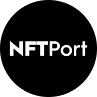

  <a href="https://nftport.xyz">
    
    <h3 align="center">NFTPort Examples</h3>
  </a>

Enjoy our curated collection of examples and solutions. Use these patterns to build your own robust and scalable applications.

## Solutions
A collection of demos, architectures and best practices.

### Demos
#### 🪙 Minting
- [NFT Minting Starter Kit](https://github.com/surgieboi/nftport-nft-minting-starter-kit): Connect a wallet and mint NFTs to it
#### 🗂️ Multi-chain Data
- [NFT Portfolio Starter Kit](https://github.com/surgieboi/nftport-nft-portfolio-starter-kit): Display a collection of NFTs from Goerli, Polygon, Rinkeby, or Solana

## Documentation

- [NFTPort Docs](https://docs.nftport.xyz/docs/nftport/ZG9jOjE5MzA4MjIy-welcome-to-nft-port-the-stripe-for-nf-ts)
- [API Status](https://status.nftport.xyz/)

If you have any questions or suggestions about the docs, feel free to [open a discussion](https://github.com/nftport/examples/issues), or [submit a PR](https://github.com/nftport/examples/pulls) with your suggestions!

## Contributing

- [Start a Discussion](https://github.com/nftport/examples/discussions) with a question, piece of feedback, or idea you want to share with the team.
- [Open an Issue](https://github.com/nftport/examples/issues) if you believe you've encountered a bug that you want to flag for the team.
- [Join our Discord](https://discord.gg/C4uqsRWgtM) for immediate questions and community support.
